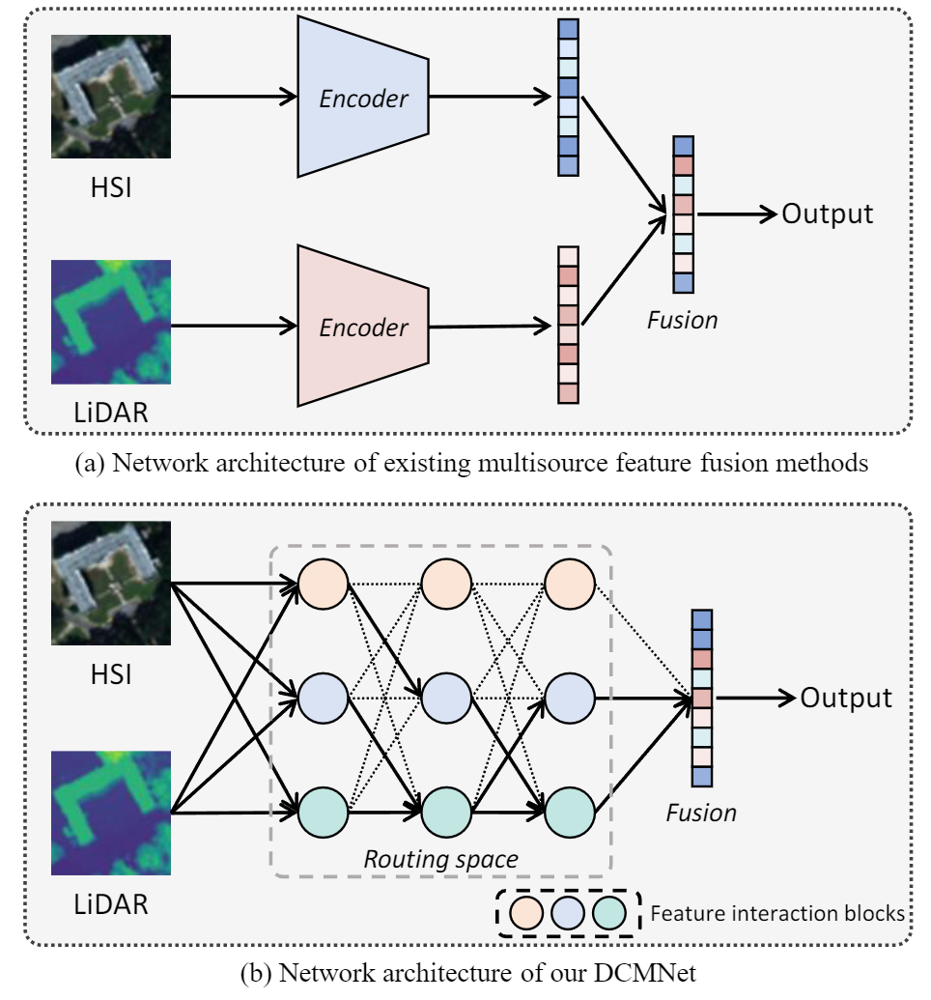

# 🚀 Dynamic Cross-Modal Feature Interaction Network for Hyperspectral and LiDAR Data Classification, IEEE TGRS 2025


## 📌 **Introduction**

This repository contains the official implementation of our paper:  
📄 *Dynamic Cross-Modal Feature Interaction Network for Hyperspectral and LiDAR Data Classification (IEEE TGRS 2025)*  

<p align="center">
  
  <p align="center">Network architecture of our DCMNet.</p>
</p>


## 📬 **Contact**

If you have any questions, feel free to contact us via Email:  
📧 Feng Gao: gaofeng@ouc.edu.cn 
📧 Junyan Lin: LinJyan00@163.com 

We hope **DCMNet** helps your research! ⭐ 

---

## Dataset
The dataset can be downloaded from the following link:  
[Download Dataset](https://drive.google.com/file/d/1iZEIAVhlt2QJb_RECp0bHFVN7C8po8ag/view?usp=sharing)

---

## Usage

### Training on the Houston 2018 Dataset
Run the following command:  
```bash
python main.py
